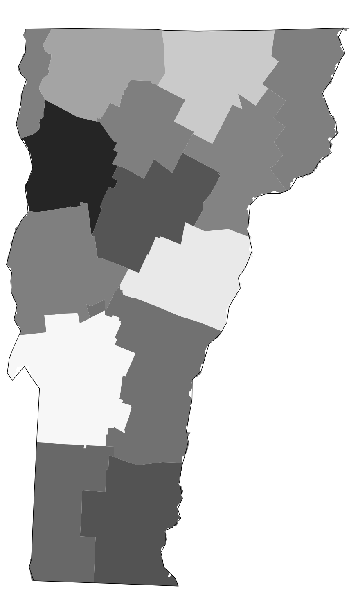
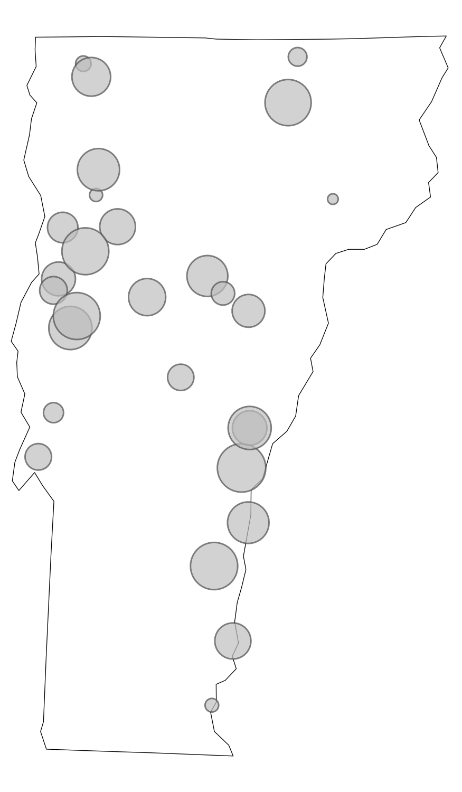
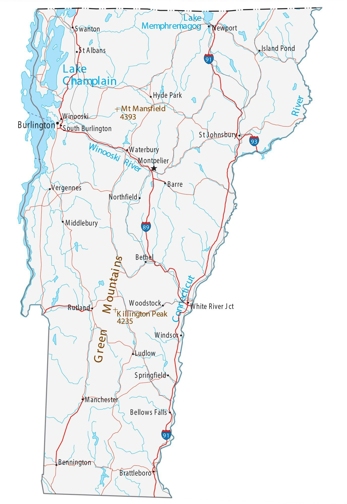

```{=html}
<style>
.reveal pre code { max-height: 800px; }
</style>
```

## Follow Along

Scan to download the R script used in today's demo:

{fig-align="center" height="600px"}

## Agenda

::: {.nonincremental}
1. Mapping basics
2. Mapping in ggplot2
3. Data from Census and NASS QuickStats
4. Point data and basic GIS operations
:::

::: {.notes}
Welcome everyone. We have about 60 minutes together. We'll do live demos along the way using demo_script.R -- feel free to open it and follow along in RStudio. Questions at the end.
:::

---

## Packages We'll Use Today

```r
install.packages(c(
  "tidyverse",   # data manipulation + ggplot2
  "sf",          # spatial data in R
  "tigris",      # US Census boundary files
  "tidycensus",  # Census + ACS data with geometry
  "rnassqs",     # NASS QuickStats API
  "mapgl",       # interactive web maps
  "classInt",    # natural breaks for color scales
  "RColorBrewer" # color palettes
))
```

```{r}
#| echo: false
library(tidyverse)
library(sf)
library(tigris)
library(tidycensus)
library(rnassqs)
library(mapgl)
library(classInt)
library(RColorBrewer)
library(scales)
library(glue)
library(viridisLite)
options(tigris_use_cache = TRUE)
```

# Part 1: Mapping Basics {background-color="#2c5f2e" color="white"}

## What Is GIS?

**Geographic Information Systems** = data + location

- Any dataset with a spatial component can be put on a map
- Agriculture is inherently spatial: counties, farms, markets, watersheds, supply chains
- Maps reveal patterns that tables and charts simply cannot

. . .

**Today's goal:** get you from zero to a working map pipeline in R

::: {.notes}
GIS has historically required specialized software (ArcGIS, QGIS). R has changed that dramatically. You can do most of what you'd do in ArcGIS from a .R script.
:::

## Types of Spatial Data

::: {.columns}
::: {.column width="55%"}
**Vector data** (what we'll use today)

| Type | Examples |
|------|---------|
| **Points** | farmers markets, food hubs, farms |
| **Lines** | roads, rivers, rail corridors |
| **Polygons** | counties, states, ZIP codes |

:::
::: {.column width="45%"}
**Raster data** (not today)

- A grid of cells, like a photo
- Elevation, land cover, satellite imagery
- Temperature, precipitation, and other climate variables
- Handled in R via `terra` / `stars`
:::
:::

::: {.notes}
Almost all the data you'll encounter in agricultural economics is vector data. County-level NASS stats map to polygons. Farmers market locations map to points. Raster data comes up in remote sensing and climate work but we won't need it today.
:::

## What Lives in an `sf` Object?

An `sf` data frame is just a regular data frame with one extra column: `geometry`

```
Simple feature collection with 3,234 features
Geometry type: MULTIPOLYGON
CRS: NAD83 (EPSG:4269)

   GEOID  NAME         STATEFP  ALAND        geometry
1  01001  Autauga      01       1539602840   MULTIPOLYGON(...)
2  01003  Baldwin      01       4117521611   MULTIPOLYGON(...)
3  01005  Barbour      01       2291820706   MULTIPOLYGON(...)
```

. . .

The `geometry` column is a list of all the coordinate pairs (longitude, latitude) that define each shape. For a polygon, it's every vertex. For a point, it's just one.

::: {.notes}
This is the key insight that makes R spatial data so ergonomic. You don't need to learn a new data model. filter(), mutate(), left_join() all work exactly as you'd expect.
:::

## Coordinate Reference Systems

**The earth is round. Maps are flat. Something has to give.**

A **CRS** defines how 3D coordinates get projected onto a 2D surface.

. . .

**Two CRS you'll use constantly:**

| CRS | EPSG | When you'll see it |
|-----|------|--------------------|
| WGS84 | **4326** | GPS coordinates, GeoJSON files, web APIs, mapgl |
| Albers Equal Area | **5070** | Thematic maps in ggplot2 |

: {tbl-colwidths="[30,12,58]"}

. . .

**Rule of thumb:** store and share data in 4326. Project to 5070 for any static map of the contiguous US.

::: {.notes}
The most common beginner mistake is mixing CRS. If your layers don't line up, 9 times out of 10 it's a mismatch. sf will warn you but always check. You reproject with st_transform(your_data, 5070).
:::

## Why Projections Matter

{fig-align="center" height="430px"}

::: {style="font-size: 0.45em; color: #888; text-align: center; margin-top: 0.2em;"}
"Comparison of tangent and secant cylindrical, conic and azimuthal map projections" by cmglee et al., [CC BY-SA 4.0](https://creativecommons.org/licenses/by-sa/4.0/), via Wikimedia Commons
:::

## Types of Maps

::: {.columns}
::: {.column width="72%"}

::: {layout-ncol=4}
{height="300px"}

{height="300px"}

{height="300px"}

{height="300px"}
:::

:::
::: {.column width="28%"}

::: {style="font-size: 0.75em;"}
**Choropleth**: areas shaded by value

**Dot map**: one dot per unit

**Proportional symbol**: symbol size = quantity

**Reference**: orientation / context
:::

:::
:::

# Part 2: Mapping in ggplot2 {background-color="#2c5f2e" color="white"}

## Getting Boundary Data

- **TIGER/Line files**: the Census Bureau's authoritative geographic boundary dataset, covering states, counties, tracts, roads, water features, and more
- **`tigris`**: an R package that downloads TIGER/Line files directly from the Census API and returns them as `sf` objects, ready to map

```{r}
states_sf <- states(cb = TRUE, resolution = "20m") %>%
  filter(!STUSPS %in% c("AK", "HI", "PR", "VI", "GU", "AS", "MP"))

counties_sf <- counties(cb = TRUE, resolution = "20m") %>%
  filter(!STATEFP %in% c("02", "15", "72", "78", "66", "60", "69"))
```

- `cb = TRUE`: simplified cartographic boundary (better for maps)
- `resolution = "20m"`: 1:20,000,000 scale (right for national maps)
- The filter removes Alaska, Hawaii, and territories

::: {.notes}
tigris has many other geographies too: tracts, block groups, places, school districts, congressional districts, ZIP codes, roads, water features. All come back as sf objects ready to use.
:::

## Your First Map

```{r}
#| output-location: slide
ggplot(states_sf) +
  geom_sf()
```

`geom_sf()` reads the `geometry` column and draws the shapes. But it looks flat and weird -- let's fix that.

## Applying a Projection

```{r}
#| output-location: slide
ggplot(states_sf) +
  geom_sf() +
  coord_sf(crs = 5070)
```

`coord_sf()` reprojects the visualization without modifying your data. This single line is the most impactful improvement you can make to a US national map.

## Styling

```{r}
#| output-location: slide
ggplot(states_sf) +
  geom_sf(fill = "dodgerblue", color = "white", linewidth = 0.3) +
  coord_sf(crs = 5070) +
  theme_void()
```

`theme_void()` removes axes, gridlines, and background -- almost always the right choice for a finished map.

## Real Data: LACE

New from the Census Bureau: county-level estimates of households without air conditioning.

```{r}
lace <- read_csv("https://www2.census.gov/programs-surveys/demo/datasets/lace/2023/LACE_23_County.csv") %>%
  mutate(GEOID = paste0(STATE, COUNTY))

lace_map <- counties_sf %>%
  left_join(lace, by = "GEOID")
```

This is the standard workflow: get boundaries from `tigris`, join your data on GEOID, map it.

::: {.notes}
GEOID is the 5-character FIPS code: 2-digit state + 3-digit county, always zero-padded. This is the universal join key for any Census-derived county data.
:::

## Building the Map Incrementally

```{r}
#| output-location: slide
ggplot(lace_map) +
  geom_sf(aes(fill = NO_AC_PE/100), color = NA) +
  geom_sf(data = states_sf, fill = NA, color = "black", linewidth = 0.1) +
  coord_sf(crs = 5070) +
  scale_fill_distiller(
    palette = "YlGn", direction = 1,
    labels = percent, name = "Share without A/C"
  ) +
  theme_void() +
  theme(legend.position = "bottom",
        plot.title = element_text(face = "bold", hjust = .5)) +
  labs(title = "Households without Air Conditioning by County (2023)")
```

::: {.notes}
[Live demo.] In demo_script.R, start with most of these arguments commented out. Uncomment one at a time so the audience can see what each piece contributes to the finished map.
:::

## Color Scale Options

```{r}
#| eval: false
# Sequential (one hue, light to dark)
scale_fill_distiller(palette = "YlGn", direction = 1)
scale_fill_viridis_c(option = "rocket")

# Diverging (two hues, use when 0 means something)
scale_fill_distiller(palette = "RdBu", direction = 1)

# Right-skewed data: log-transform the scale
scale_fill_viridis_c(trans = "log10", labels = scales::comma)
```

> Avoid rainbow palettes (`rainbow()`, `jet`). They are not perceptually uniform and create false visual boundaries in your data.

- **ColorBrewer** ([colorbrewer2.org](http://colorbrewer2.org/)) — designed by cartographer Cynthia Brewer, it provides rigorously tested sequential, diverging, and qualitative palettes optimized for maps. No need to reinvent the wheel; the cartographers already laid the groundwork.

# Part 3: Census and NASS Data {background-color="#2c5f2e" color="white"}

## `tidycensus`

`tidycensus` pulls Census Bureau data directly into R, with geometry attached if you want it.

```{r}
#| eval: false
# one-time setup -- free key at api.census.gov/data/key_signup.html
census_api_key("YOUR_KEY_HERE", install = TRUE)
```

**Covers:** Decennial Census, ACS 1-year and 5-year, and more

::: {.notes}
ACS data is estimated, not a headcount. The smaller the geography, the larger the margin of error. A block group SNAP estimate has a much wider confidence interval than a county-level estimate.
:::

## Finding Variables

```{r}
v22 <- load_variables(2022, "acs5", cache = TRUE)
```

```{r}
#| output-location: fragment
v22 %>%
  filter(str_detect(label, regex("snap|food stamp", ignore_case = TRUE))) %>%
  select(name, label, concept)
```

There are ~27,000 ACS 5-year variables. `load_variables()` + `str_detect()` is how you find what you need.

## Pulling SNAP Data with Geometry

```{r}
snap_households <- get_acs(
  geography = "county",
  variables = c(snap  = "B22003_002",
                total = "B22003_001"),
  year      = 2022,
  geometry  = TRUE
) %>%
  select(GEOID, NAME, variable, estimate) %>%
  pivot_wider(names_from = variable, values_from = estimate) %>%
  mutate(snap_pct = snap / total) %>%
  filter(!str_starts(GEOID, "02|15|72"))
```

`geometry = TRUE` is the killer feature: one call returns data and boundaries together.

## SNAP Participation by County

```{r}
#| output-location: slide
ggplot(snap_households) +
  geom_sf(aes(fill = snap_pct), color = NA) +
  geom_sf(data = states_sf, fill = NA, color = "white", linewidth = 0.4) +
  coord_sf(crs = 5070) +
  scale_fill_viridis_c(
    name = "Share of households receiving SNAP",
    labels = percent_format(accuracy = 1),
    option = "rocket", 
    direction = -1
  ) +
  theme_void(base_family = "Verdana") +
  theme(legend.position = "bottom",
        legend.title = element_text(face = "bold", hjust = .5),
        plot.title = element_text(face = "bold", hjust = .5),
        plot.subtitle = element_text(hjust = .5)) +
  guides(fill = guide_colourbar(barheight = 0.35, barwidth = 15, title.position = "top")) +
  labs(title = "SNAP Participation by County",
       subtitle = "2018-2022 5-year ACS Estimates")
```

## Going Smaller: Census Tracts

Change `geography = "county"` to `geography = "tract"` and add a `state` argument:

```{r}
#| output-location: slide
get_acs(
  geography = "tract", state = "RI",
  variables = c(snap = "B22003_002", total = "B22003_001"),
  year = 2024, geometry = TRUE
) %>%
  select(GEOID, NAME, variable, estimate) %>%
  pivot_wider(names_from = variable, values_from = estimate) %>%
  mutate(snap_pct = snap / total) %>%
  ggplot() +
  geom_sf(aes(fill = snap_pct), color = NA) +
  scale_fill_viridis_c(option = "A", direction = -1,
                       labels = percent_format(accuracy = 1),
                       na.value = "grey90") +
  theme_void() +
  labs(title = "SNAP Participation by Census Tract, Rhode Island",
       subtitle = "2020-2024 5-year ACS Estimates")
```

::: {.notes}
Everything is the same except geography and state. tidycensus supports county, tract, block group, place, ZCTA, and more.
:::

## NASS QuickStats: `rnassqs`

NASS QuickStats is USDA's public database: crops, livestock, farm economics, farm counts, and more.

```{r}
#| eval: false
# one-time setup per session -- free key at quickstats.nass.usda.gov/api
nassqs_auth("YOUR_API_KEY")
```

**Tip:** prototype at [quickstats.nass.usda.gov](https://quickstats.nass.usda.gov) first to get exact parameter names and verify record counts before calling the API.

## Querying NASS: Corn and Soybeans

```{r}
#| echo: false
nassqs_auth(key = "EA66C6CC-BD02-3B40-9C6D-0366A79B6FD8")
```

```{r}
#| results: hide
corn_acres <- nassqs(
  commodity_desc = "CORN", short_desc = "CORN - ACRES PLANTED",
  domain_desc = "TOTAL", agg_level_desc = "COUNTY", year = 2015
) %>%
  mutate(GEOID = paste0(state_fips_code, county_code)) %>%
  select(GEOID, year, corn_acres_planted = Value)

soybean_acres <- nassqs(
  commodity_desc = "SOYBEANS", short_desc = "SOYBEANS - ACRES PLANTED",
  domain_desc = "TOTAL", agg_level_desc = "COUNTY", year = 2015
) %>%
  mutate(GEOID = paste0(state_fips_code, county_code)) %>%
  select(GEOID, year, soybean_acres_planted = Value)

corn_acres_sf    <- left_join(counties_sf, corn_acres)
soybean_acres_sf <- left_join(counties_sf, soybean_acres)
```

## Corn Acres Planted, 2015

```{r}
#| output-location: slide
ggplot(corn_acres_sf) +
  geom_sf(aes(fill = corn_acres_planted), color = NA) +
  geom_sf(data = states_sf, fill = NA, color = "white", linewidth = 0.4) +
  coord_sf(crs = 5070) +
  scale_fill_viridis_c(option = "A", name = "Corn Acres Planted",
                       labels = comma_format(), trans = "log10", na.value = "gray90") +
  theme_void(base_family = "Verdana") +
  theme(legend.position = "bottom",
        legend.title = element_text(face = "bold", hjust = .5),
        plot.title = element_text(face = "bold", hjust = .5)) +
  guides(fill = guide_colourbar(barheight = 0.35, barwidth = 15, title.position = "top")) +
  labs(title = "Corn Acres Planted by County, 2015",
       caption = "\nSource: USDA NASS QuickStats. Suppressed/missing counties shown in gray.")
```

## Soybean Acres Planted, 2015

```{r}
#| output-location: slide
ggplot(soybean_acres_sf) +
  geom_sf(aes(fill = soybean_acres_planted), color = NA) +
  geom_sf(data = states_sf, fill = NA, color = "white", linewidth = 0.4) +
  coord_sf(crs = 5070) +
  scale_fill_viridis_c(option = "A", name = "Soybean Acres Planted",
                       labels = comma_format(), trans = "log10", na.value = "gray90") +
  theme_void(base_family = "Verdana") +
  theme(legend.position = "bottom",
        legend.title = element_text(face = "bold", hjust = .5),
        plot.title = element_text(face = "bold", hjust = .5)) +
  guides(fill = guide_colourbar(barheight = 0.35, barwidth = 15, title.position = "top")) +
  labs(title = "Soybean Acres Planted by County, 2015",
       caption = "\nSource: USDA NASS QuickStats. Suppressed/missing counties shown in gray.")
```

## Finding Better Breaks: Jenks

Right-skewed ag data looks like one color with a linear scale. Jenks natural breaks fix that.

```{r}
corn_vals <- as.numeric(str_remove_all(corn_acres_sf$corn_acres_planted, ","))
soy_vals  <- as.numeric(str_remove_all(soybean_acres_sf$soybean_acres_planted, ","))
combined  <- c(corn_vals, soy_vals)

brks <- classIntervals(
  combined[!is.na(combined) & combined > 0], n = 5, style = "jenks"
)$brks %>% round(-3)

pal <- brewer.pal(length(brks), "YlGnBu")
```

Using the combined distribution ensures both maps share the same color scale.

## Comparing Maps with `compare()`

```{r}
#| eval: true
#| output-location: slide
left_map <- maplibre(bounds = states_sf, style = carto_style("voyager")) %>%
  add_fill_layer(id = "corn_acres", source = corn_acres_sf,
    fill_color = interpolate(column = "corn_acres_planted",
                             values = brks, stops = pal, na_color = "lightgrey"),
    fill_opacity = 0.9, tooltip = "corn_acres_planted") %>%
  add_line_layer(id = "states", source = states_sf, line_width = .1) %>%
  add_continuous_legend("Corn Acres Planted, 2015",
    values = brks, colors = pal, position = "bottom-left")

right_map <- maplibre(bounds = states_sf, style = carto_style("voyager")) %>%
  add_fill_layer(id = "soybean_acres", source = soybean_acres_sf,
    fill_color = interpolate(column = "soybean_acres_planted",
                             values = brks, stops = pal, na_color = "lightgrey"),
    fill_opacity = 0.9, tooltip = "soybean_acres_planted") %>%
  add_line_layer(id = "states", source = states_sf, line_width = .1) %>%
  add_continuous_legend("Soybean Acres Planted, 2015",
    values = brks, colors = pal, position = "bottom-left")

compare(left_map, right_map, height = "900px")
```

# Part 4: Point Data and GIS {background-color="#2c5f2e" color="white"}

## From Table to Map

Any table with latitude and longitude columns can become a spatial dataset.

```{r}
#| output-location: fragment
usda_inspection_estabs <- read_csv("https://andrewvanleuven.github.io/aaea_webinar/data/MPI_Directory_by_Establishment_Number.csv")
glimpse(usda_inspection_estabs)
```

::: {.notes}
Source: USDA FSIS Meat, Poultry & Egg Product Inspection Directory.
:::

## `st_as_sf()`: Adding Geometry

```{r}
usda_inspection_estabs_sf <- usda_inspection_estabs %>%
  mutate(across(where(is.character), ~iconv(., to = "UTF-8", sub = ""))) %>%
  st_as_sf(coords = c("longitude", "latitude"), crs = 4326, remove = FALSE) %>%
  st_transform(crs = 5070)

lower48_usda <- st_intersection(
  usda_inspection_estabs_sf,
  st_transform(states_sf, 5070)
) %>%
  filter(size %in% c("Large", "Small", "Very Small"))
```

`st_as_sf()` turns lat/lon columns into a `geometry` column. After that, it's a normal `sf` object.

## USDA Inspection Establishments

```{r}
#| output-location: slide
ggplot() +
  geom_sf(data = st_transform(states_sf, 5070), color = "black", linewidth = .25) +
  geom_sf(data = lower48_usda, aes(color = size), size = 1, alpha = .7) +
  scale_color_manual(values = c("#e41a1c", "#e6ab02", "#377eb8"), name = "Size") +
  theme_void(base_family = "Verdana") +
  theme(legend.position = "bottom",
        legend.title = element_text(face = "bold", hjust = .5),
        plot.subtitle = element_text(hjust = .5),
        plot.title = element_text(face = "bold", hjust = .5)) +
  labs(title = "USDA Meat, Poultry & Egg Product Inspection",
       subtitle = "Establishments by Size Class")
```


## Categorical Point Maps with `mapgl`

```{r}
#| eval: true
#| output-location: slide
gas_stations <- read_csv("https://andrewvanleuven.github.io/aaea_webinar/data/gas_stations.csv") %>%
  st_as_sf(wkt = "geometry_wkt", crs = 4326) %>%
  st_transform(crs = 5070)

maplibre(style = carto_style("positron"), bounds = states_sf) %>%
  add_circle_layer(
    id = "poi-gas", source = gas_stations,
    circle_color = match_expr("name",
      values = c("Casey's General Store", "Cenex", "Kwik Trip/Kwik Star"),
      stops  = c("#F3D317", "#8a0000", "#0300ad")),
    circle_radius = 4, circle_stroke_color = "#ffffff",
    circle_stroke_width = .4, circle_opacity = 0.7, tooltip = "city_name"
  ) %>%
  add_line_layer(id = "states", source = states_sf, line_width = .1) %>%
  add_categorical_legend(
    legend_title = "Midwest Gas Station Chains",
    values = c("Casey's General Store", "Cenex", "Kwik Trip/Kwik Star"),
    colors = c("#F3D317", "#8a0000", "#0300ad"),
    patch_shape = "circle", position = "bottom-left",
    layer_id = "poi-gas", interactive = TRUE
  )
```


## Categorical Point Maps with `mapgl`

```{r}
#| eval: true
#| output-location: slide
dollar_stores <- read_csv("https://andrewvanleuven.github.io/aaea_webinar/data/dollar_stores.csv") %>%
  st_as_sf(wkt = "geometry_wkt", crs = 4326) %>%
  st_transform(crs = 5070) %>%
  mutate(tooltip = glue("<b>{name}</b><br>{city_name}"))

maplibre(style = carto_style("positron"), bounds = states_sf) %>%
  add_circle_layer(
    id           = "poi-dollar-store",
    source       = dollar_stores,
    circle_color = match_expr(
      "name",
      values = c("Dollar General", "Dollar Tree", "Family Dollar"),
      stops  = c("#fff200", "#00954C", "#E81F11")
    ),
    circle_radius       = 4,
    circle_stroke_color = "black",
    circle_stroke_width = .4,
    circle_opacity      = 0.7,
    tooltip             = "tooltip"
  ) %>%
  add_categorical_legend(
    legend_title = "Dollar Store Establishments",
    values       = c("Dollar General", "Dollar Tree", "Family Dollar"),
    colors       = c("#fff200", "#00954C", "#E81F11"),
    patch_shape  = "circle",
    position     = "bottom-left",
    layer_id     = "poi-dollar-store",
    interactive  = TRUE
  )

```

## `st_intersection`: Points in Polygons

```{r}
dollar_stores <- read_csv("https://andrewvanleuven.github.io/aaea_webinar/data/dollar_stores.csv") %>%
  st_as_sf(wkt = "geometry_wkt", crs = 4326) %>%
  st_transform(crs = 5070) %>%
  mutate(tooltip = glue("<b>{name}</b><br>{city_name}"))

county_pop_2020 <- get_decennial(geography = "county", variables = "P1_001N",
  year = 2020, geometry = TRUE) %>%
  st_transform(5070) %>%
  filter(!str_starts(GEOID, "02|15|72")) %>%
  select(cty_fips = GEOID, pop20 = value)

dollar_store_sf <- st_intersection(dollar_stores, county_pop_2020) %>%
  st_drop_geometry() %>%
  summarize(dollar_stores = n(), pop_2020 = first(pop20), .by = cty_fips) %>%
  replace_na(list(dollar_stores = 0)) %>%
  mutate(dollar_stores_per_capita = dollar_stores / pop_2020) %>%
  right_join(county_pop_2020, by = "cty_fips") %>%
  st_as_sf()
```

## Raw Counts vs Per Capita

```{r}
#| output-location: slide
p1 <- ggplot() +
  geom_sf(data = dollar_store_sf, aes(fill = dollar_stores), color = NA) +
  geom_sf(data = states_sf, color = "white", linewidth = .35, fill = NA) +
  scale_fill_viridis_c(option = "mako", name = "# Establishments",
                       trans = "log10", direction = -1, na.value = "gray90") +
  theme_void() + theme(legend.position = "bottom") +
  labs(title = "Raw counts")

p2 <- ggplot() +
  geom_sf(data = dollar_store_sf,
          aes(fill = dollar_stores_per_capita * 10000), color = NA) +
  geom_sf(data = states_sf, color = "black", linewidth = .15, fill = NA) +
  scale_fill_distiller(palette = "YlOrBr", name = "Per 10,000 residents",
                       direction = 1, na.value = "white") +
  theme_void() + theme(legend.position = "bottom") +
  labs(title = "Per capita")

library(patchwork)
p1 + p2
```

::: {.notes}
Raw counts favor dense, populous counties. Per-capita rates let you compare across places of very different sizes. Always normalize for a choropleth unless you're specifically making a point about total volume.
:::

## Buffer Analysis: `st_buffer`

```{r}
#| eval: true
#| output-location: slide
iowa_dollar_stores <- dollar_stores %>%
  filter(state == "IA") %>%
  st_transform(6463) %>%
  st_buffer(10 * 5280) %>%
  st_transform(4326)

maplibre(bounds = filter(states_sf, STUSPS == "IA"),
         style = carto_style("positron")) %>%
  add_fill_layer(
    id = "buffers", source = iowa_dollar_stores,
    fill_color = "#202020", fill_opacity = 0.4
  )
```

`st_buffer()` creates a polygon a fixed distance around each point. CRS 6463 (Iowa State Plane) uses U.S. feet, so 1 mile = 5,280 feet.

## From Dense Points to Heatmap

```{r}
#| eval: true
#| output-location: slide
iowa_pts <- dollar_stores %>%
  filter(state == "IA") %>%
  st_transform(4326) %>%
  st_jitter(factor = 0.0001)

maplibre(style = carto_style("positron"),
         bounds = filter(states_sf, STUSPS == "IA")) %>%
  add_circle_layer(
    id = "poi-dollar-store", source = iowa_pts,
    circle_color = "red", circle_stroke_color = "white", circle_stroke_width = 1
  ) %>%
  add_heatmap_layer(
    id = "heatmap", source = iowa_pts, heatmap_radius = 35,
    heatmap_color = interpolate(
      property = "heatmap-density", values = seq(0, 1, 0.2),
      stops = c("transparent", magma(5))
    )
  )
```

## More Things `sf` Can Do

```r
st_distance()        # distance between features (in CRS units)
st_nearest_feature() # index of the nearest feature in another layer
st_centroid()        # geometric center of a polygon
st_area()            # area of a polygon (in CRS units)
st_union()           # merge / dissolve geometries into one
st_bbox()            # bounding box of a layer
st_crop()            # clip features to a rectangular extent
st_within()          # is feature A fully inside feature B?
st_touches()         # do features share a boundary?
```

sf cheat sheet: [rstudio.github.io/cheatsheets/sf.pdf](https://rstudio.github.io/cheatsheets/sf.pdf)

# Wrap Up {background-color="#2c5f2e" color="white"}

## What We Covered

::: {.nonincremental}
1. **Mapping basics**: vector vs. raster data, coordinate reference systems, map types
2. **ggplot2 maps**: `tigris` for boundaries, `geom_sf()`, projections, color scales, choropleth maps
3. **Census and NASS data**: `tidycensus` with geometry, SNAP participation maps, `rnassqs` for QuickStats, classification breaks, side-by-side map comparison
4. **Point data and GIS operations**: `st_as_sf()`, categorical styling, spatial joins, counts vs. rates, buffer analysis, heatmaps
:::


## Thank You

**Andrew Van Leuven**
University of Vermont

[andrew.vanleuven@uvm.edu](mailto:andrew.vanleuven@uvm.edu)

[https://andrewvanleuven.com](https://andrewvanleuven.com)

. . .

**Questions?**

::: {.notes}
Thank the organizers (Zoë Plakias, Anne Byrne, and the challenge committee). Remind folks about the challenge deadline and the other two webinars (Jared Hutchins on data viz principles, Sid Bora on R data viz).
:::
