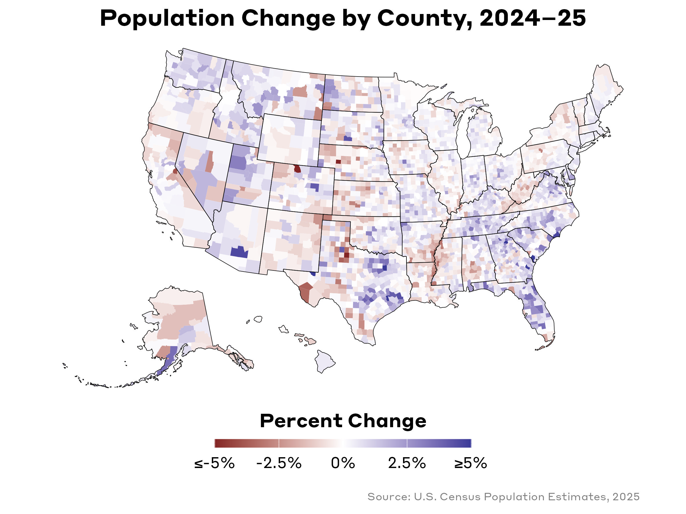

Today marks the release of the latest batch of data from the U.S. Census Bureau: the [2025 County Population Totals and Components of Change](https://www.census.gov/data/tables/time-series/demo/popest/2020s-counties-total.html). Below is a collection of a few interactive maps that visualize changes that have taken place since last year, as well as a quick guide (including code snippets) for how to load, clean, and map the data.

# Interactive Maps

The most obvious variable that we'd want to observe is the growth (or decline) from last year to this year. What counties grew? Which ones shrank? Let's look at a simple choropleth map visualizing the percent change in county population between 2024 and 2025.

```{r}
#| include: false
library(glue)
library(tidyverse)
library(tigris)
library(janitor)
library(sf)
library(scales)
library(mapgl)

df <- read_csv('co-est2025-alldata.csv',
  locale = locale(encoding = "latin1")) |>
  clean_names() |>
  mutate(cty_fips = paste0(str_pad(state, 2, pad = '0'), str_pad(county, 3, pad = '0'))) |>
  select(cty_fips, everything()) |>
  filter(sumlev == '050')

usa <- counties(cb = T, resolution = '20m') |>
  # shift_geometry() |>
  filter(STATEFP < 60) |>
  select(cty_fips = GEOID) |>
  left_join(df) |>
  mutate(
    #---population change ---
    pop_chg_2024_25  = (popestimate2025 - popestimate2024) / popestimate2024,
    pop_chg_2023_24  = (popestimate2024 - popestimate2023) / popestimate2023,
    pop_chg_2020_25  = (popestimate2025 - popestimate2020) / popestimate2020,
    pop_chg_raw_2024_25  = (popestimate2025 - popestimate2024),
    pop_chg_raw_2023_24  = (popestimate2024 - popestimate2023),
    #---natural change direction ---
    natural_negative_2025 = naturalchg2025 < 0,
    #---quadrant classification (natural change vs. net migration, 2025) ---
    growth_type = case_when(
      naturalchg2025 >= 0 & netmig2025 >= 0 ~ "Growing Both Ways",
      naturalchg2025 <  0 & netmig2025 >= 0 ~ "Migration-Dependent",
      naturalchg2025 >= 0 & netmig2025 <  0 ~ "Birth-Dependent",
      naturalchg2025 <  0 & netmig2025 <  0 ~ "Declining Both Ways"
    ),
    growth_type = factor(growth_type, levels = c(
      "Growing Both Ways", "Migration-Dependent",
      "Birth-Dependent",   "Declining Both Ways"
    ))
  )

# State outlines for map overlays
us <- summarise(group_by(usa, stname))

us48 <- filter(us, !stname %in% c('Alaska','Hawaii')) |>
  st_transform(4326)

usa <- usa |>
  mutate(
    pop_pct_2024_25 = pop_chg_2024_25 * 100,
    pop_pct_2023_24 = pop_chg_2023_24 * 100,
    full_name = paste0(ctyname, ', ', stname),
    tooltip_html = glue::glue(
      "<b>{full_name}</b><br>
      2025 Population: {scales::comma(popestimate2025)}<br>
      2024\u201325 Change: {scales::comma(pop_chg_raw_2024_25)}<br>
      Percent Change: {scales::percent(pop_chg_2024_25, accuracy = 0.1)}"
    ),
    tooltip_html2 = glue::glue(
      "<b>{full_name}</b><br>
      2024 Population: {scales::comma(popestimate2024)}<br>
      2023\u201324 Change: {scales::comma(pop_chg_raw_2024_25)}<br>
      Percent Change: {scales::percent(pop_chg_2024_25, accuracy = 0.1)}"
    )
  )

# Trim to only the columns needed for maps and tables
usa <- usa |> select(
  cty_fips, stname, ctyname, full_name,
  pop_pct_2024_25, pop_pct_2023_24, pop_chg_2024_25,
  naturalchg2025, netmig2025, growth_type,
  births2025, deaths2025, domesticmig2025,
  rinternationalmig2024, rinternationalmig2025,
  internationalmig2024, internationalmig2025,
  tooltip_html, tooltip_html2
)

dfc <- read_csv('cbsa-est2025-alldata.csv',
  locale = locale(encoding = "latin1")) |> 
  clean_names() |> 
  filter(str_detect(lsad,'politan Stat')) |> 
  select(cbsa_fips = 1, cbsa_name = 4, cbsa_type = 5, everything(), -2, -3) |> 
  arrange(cbsa_fips) |> 
  mutate(cbsa_fips = str_pad(cbsa_fips, 5, pad = '0'))

cbsa_sf <- core_based_statistical_areas(T, resolution = '20m', year = 2024) |> 
  filter(str_detect(NAME, ', PR', negate = T)) |> 
  select(cbsa_fips = 2) |> 
  left_join(dfc) |> 
  mutate(pop_chg_2024_25  = (popestimate2025 - popestimate2024) / popestimate2024,
         pop_chg_raw_2024_25  = popestimate2025 - popestimate2024,
         pop_pct_2024_25 = pop_chg_2024_25*100,
    tooltip_html = glue::glue(
      "<b>{cbsa_name}</b><br>
      <b>{cbsa_type}</b><br>
      2025 Population: {scales::comma(popestimate2025)}<br>
      2024\u201325 Change: {scales::comma(pop_chg_raw_2024_25)}<br>
      Percent Change: {scales::percent(pop_chg_2024_25, accuracy = 0.1)}"
    ))

metro <- filter(cbsa_sf, str_starts(cbsa_type, 'Metro')) |> 
  st_centroid() 

micro <- filter(cbsa_sf, str_starts(cbsa_type, 'Micro')) |> 
  st_centroid() 

```

### Population Change, 2024---25

```{r}
#| echo: false
#| message: false
#| warning: false
maplibre(bounds = us48, style = carto_style('positron')) |>
  # Layer 1: 2024-25
  add_fill_layer(
    id = '2024-25 Population Change',
    source = usa,
    fill_color = interpolate(
      column = "pop_pct_2024_25",
      values = c(-5, 0, 5),
      stops = RColorBrewer::brewer.pal(3, "RdBu"),
      na_color = "lightgrey"
    ),
    fill_opacity = 0.9,
    tooltip = "tooltip_html",
    visibility = "visible"
  ) |>
  # Layer 2: 2023-24
  add_fill_layer(
    id = '2023-24 Population Change',
    source = usa,
    fill_color = interpolate(
      column = "pop_pct_2023_24",
      values = c(-5, 0, 5),
      stops = RColorBrewer::brewer.pal(3, "RdBu"),
      na_color = "lightgrey"
    ),
    fill_opacity = 0.9,
    tooltip = "tooltip_html2",
    visibility = "none" # Start hidden
  ) |>
  # Shared outlines
  add_line_layer(
    id = 'cty_outlines',
    source = usa,
    line_color = 'black',
    line_width = 0.05
  ) |>
  add_line_layer(
    id = 'st_outlines',
    source = us,
    line_color = 'black',
    line_width = 0.4
  ) |>
  add_continuous_legend(
  "Percent Change in Population",
  values = c(-5, -2.5, 0, 2.5, 5),
  colors = RColorBrewer::brewer.pal(5, "RdBu"),
  position = "bottom-left",
  draggable = T
  ) |>  
  add_layers_control(
    layers = c(
      "2024-25" = "2024-25 Population Change",
      "2023-24" = "2023-24 Population Change"
    ),
    position = "top-left",
    collapsible = FALSE
  )
```

You can click on the buttons on the top-left to toggle between the 2024-25 and 2023-24 percent change in population growth. One interesting pattern that emerges is the clear continuation of our love affair with suburbs: if you look at places like Houston, TX or Indianapolis, IN, it is apparent that the outlying counties are experiencing growth while the central county---Harris County, TX and Marion County, IN, respectively---are not. 

A quick look at core-based statistical areas (CBSAs) illustrates which metropolitan and micropolitan areas are growing or shrinking. CBSAs cut through the county-boundary noise by grouping counties into functionally connected labor markets. For example, rather than asking whether Williamson County, TX grew, you can ask whether the Austin metro grew as a whole. Toggle between Metro and Micro using the control in the top-left.

```{r}
#| echo: false
#| message: false
#| warning: false
maplibre(bounds = us48, style = carto_style('positron')) |>
  add_line_layer(
    id = 'st_outlines',
    source = us,
    line_color = 'black',
    line_width = 0.4
  ) |>
  add_circle_layer(
    id = 'metro-pop-change',
    source = metro,
    circle_color = interpolate(
      column = "pop_pct_2024_25",
      values = c(-2.5, 0, 2.5),
      stops = RColorBrewer::brewer.pal(3, "RdYlBu"),
      na_color = "lightgrey"
    ),
    circle_stroke_color = 'black',
    circle_stroke_width = .5,
    circle_opacity = 0.9,
    tooltip = "tooltip_html",
    popup = "tooltip_html"
  ) |>
  add_circle_layer(
    id = 'micro-pop-change',
    source = micro,
    circle_color = interpolate(
      column = "pop_pct_2024_25",
      values = c(-2.5, 0, 2.5),
      stops = RColorBrewer::brewer.pal(3, "RdYlBu"),
      na_color = "lightgrey"
    ),
    circle_stroke_color = 'black',
    circle_stroke_width = .5,
    circle_opacity = 0.9,
    tooltip = "tooltip_html",
    popup = "tooltip_html",
    visibility = "none"
  ) |>
  add_continuous_legend(
  "Percent Change in Population",
  values = c(-2.5, 0, 2.5),
  colors = RColorBrewer::brewer.pal(3, "RdYlBu"),
  position = "bottom-left",
  draggable = T
  ) |>  
  add_layers_control(
    layers = c(
      "Metro" = 'metro-pop-change',
      "Micro" = 'micro-pop-change'
    ),
    position = "top-left",
    collapsible = FALSE
  )
```

### Population Growth Hotspots

Beyond spotting individual counties, it's harder to identify *regional* clusters where growth or decline persisted across a wider area. The map below uses spatial "hotspots" and "coldspots" to do just that---flagging counties where high or low growth isn't a local fluke, but part of a broader pattern shared by their neighbors.


```{r}
#| include: false
library(spdep)

# Project to Albers for accurate contiguity; exclude AK/HI (non-contiguous islands)
usa_go <- usa |>
  st_transform(5070) |>
  filter(!stname %in% c('Alaska', 'Hawaii'))

nb <- poly2nb(usa_go, queen = TRUE)
lw <- nb2listw(nb, style = "W", zero.policy = TRUE)

gi_star <- localG(usa_go$pop_chg_2024_25, lw, zero.policy = TRUE)

hs_colors <- c(
  "Hot Spot (99%)"  = "#b2182b",
  "Hot Spot (95%)"  = "#ef8a62",
  "Hot Spot (90%)"  = "#fddbc7",
  "Not Significant" = "#ffffff",
  "Cold Spot (90%)" = "#e0e0e0",
  "Cold Spot (95%)" = "#999999",
  "Cold Spot (99%)" = "#4d4d4d"
)

usa_go <- usa_go |>
  mutate(
    gi_z = as.numeric(gi_star),
    hotspot = case_when(
      gi_z >= 2.576  ~ "Hot Spot (99%)",
      gi_z >= 1.960  ~ "Hot Spot (95%)",
      gi_z >= 1.645  ~ "Hot Spot (90%)",
      gi_z <= -2.576 ~ "Cold Spot (99%)",
      gi_z <= -1.960 ~ "Cold Spot (95%)",
      gi_z <= -1.645 ~ "Cold Spot (90%)",
      TRUE           ~ "Not Significant"
    ),
    hotspot = factor(hotspot, levels = names(hs_colors)),
    tooltip_hotspot = glue::glue(
      "<b>{full_name}</b><br>
      Class: {hotspot}<br>
      Gi* Z-score: {round(gi_z, 2)}"
    )
  ) |>
  st_transform(4326)
```

```{r}
#| echo: false
#| message: false
#| warning: false
maplibre(bounds = us48, style = carto_style('positron')) |>
  add_fill_layer(
    id = 'hotspots',
    source = usa_go,
    fill_color = match_expr(
      column  = "hotspot",
      values  = names(hs_colors),
      stops   = unname(hs_colors),
      default = "#cccccc"
    ),
    fill_opacity = 0.9,
    tooltip = "tooltip_hotspot"
  ) |>
  add_line_layer(
    id = 'cty_outlines',
    source = usa_go,
    line_color = 'black',
    line_width = 0.05
  ) |>
  add_line_layer(
    id = 'state_outlines',
    source = us,
    line_color = 'black',
    line_width = 0.4
  ) |>
  add_categorical_legend(
    "",
    patch_shape = "circle",
    values = names(hs_colors),
    colors = unname(hs_colors),
    position = "bottom-left",
    draggable = TRUE
  )
```

From this map, we can see that several of the post-COVID "winners" are continuing to see clustered patterns of regional growth. These areas include: 

* The Wasatch Front (Salt Lake City, Provo, and Ogden) and surrounding Utah counties
* The Texas I-35/I-45 triangle: Houston, Austin, and San Antonio, converging into the Dallas-Ft. Worth area and ending in the Oklahoma City metro
* Northwest Arkansas and Southwest Missouri
* The Piedmont Atlantic Megaregion (the arc of mid-sized Sun Belt metros running from Nashville through Atlanta and up through Charlotte and Raleigh-Durham)
* Northern Virginia, and---perhaps surprisingly---the Hagerstown corridor in western Maryland, which sits along the I-81 freight and commuter spine that connects the DC exurbs to the southern Pennsylvania border
* Various counties in WA, MT, and ND along the northwest border with Canada

The map also highlights several cold spots: counties where not just local population growth was low, but where neighboring counties showed similarly weak or negative growth, forming statistically significant regional clusters of decline. Some of these areas included:

* Mississippi Delta counties in AR, LA, and MS
* Counties along the Texas-Mexico border
* Swaths of Great Plains counties ranging from the Texas Panhandle up to Western Nebraska
* Appalachian counties along the KY-WV border

It's worth noting that a statistical hot or cold spot doesn't mean every county within it is booming or collapsing in isolation. What Getis-Ord Gi* measures is *spatial autocorrelation*: whether a county's growth rate is similar to its neighbors' at a level unlikely to occur by chance. A hot spot means a county and its surrounding region are all growing together; a cold spot means decline (or stagnation) is a regional pattern, not just a local anomaly. The confidence levels (90%, 95%, 99%) reflect how certain we are that the clustering isn't random.

### International Migration Rates

Beyond total population change, the Census also breaks out *how* counties are growing---specifically what share of growth comes from international migration. This matters because international in-migration has been one of the primary drivers of U.S. population growth over the past decade, particularly in large metros and agricultural counties that rely on immigrant labor. 

The comparison below shows the international migration rate (per 1,000 residents) in each county for 2023–24 versus 2024–25. Given the significant shift in federal immigration policy that took effect in early 2025, this comparison offers a county-level look at whether those changes show up yet in the population data.

```{r}
#| echo: false
#| message: false
#| warning: false
a <- maplibre(bounds = us48, style = carto_style('positron')) |>
  add_fill_layer(
    id = 'counties',
    source = usa,
    fill_color = interpolate(
      column = "rinternationalmig2024",
      values = c(0,5,10,15,20),
      stops = RColorBrewer::brewer.pal(5, "Oranges"),
      na_color = "lightgrey"
    ),
    fill_opacity = 0.9,
    tooltip = "tooltip_html",
    popup = "tooltip_html"
  ) |>
  add_line_layer(
    id = 'cty_outlines',
    source = usa,
    line_color = 'black',
    line_width = 0.05
  ) |>
  add_line_layer(
    id = 'state_outlines',
    source = us,
    line_color = 'black',
    line_width = 0.4
  ) |>
  add_continuous_legend(
    "International Migration Rate\n (per 1,000) in 2024",
    values = c(0,5,10,15,20),
    colors = RColorBrewer::brewer.pal(5, "Oranges"),
    position = "bottom-left",
    draggable = T
  )

b <- maplibre(bounds = us48, style = carto_style('positron')) |>
  add_fill_layer(
    id = 'counties',
    source = usa,
    fill_color = interpolate(
      column = "rinternationalmig2025",
      values = c(0,5,10,15,20),
      stops = RColorBrewer::brewer.pal(5, "Oranges"),
      na_color = "lightgrey"
    ),
    fill_opacity = 0.9,
    tooltip = "tooltip_html",
    popup = "tooltip_html"
  ) |>
  add_line_layer(
    id = 'cty_outlines',
    source = usa,
    line_color = 'black',
    line_width = 0.05
  ) |>
  add_line_layer(
    id = 'state_outlines',
    source = us,
    line_color = 'black',
    line_width = 0.4
  ) |>
  add_continuous_legend(
    "International Migration Rate\n (per 1,000) in 2025",
    values = c(0,5,10,15,20),
    colors = RColorBrewer::brewer.pal(5, "Oranges"),
    position = "bottom-left",
    draggable = T
  )

compare(a,b)
```
The geographic footprint of international in-migration is strikingly similar between the two years. The same coastal metros, agricultural valleys, and border-adjacent counties that drew international migrants in 2023–24 continued to do so in 2024–25. What changed is the *intensity*: rates fell across most of the country from one year to the next. The table below breaks this down by state, showing the 15 states that received the most international migrants in 2024–25 and how that compares to the prior year.

```{r}
#| echo: false
#| message: false
#| warning: false
library(gt)

usa |>
  st_drop_geometry() |>
  group_by(stname) |>
  summarise(
    `2023-24` = sum(internationalmig2024, na.rm = TRUE),
    `2024-25` = sum(internationalmig2025, na.rm = TRUE),
    .groups = "drop"
  ) |>
  mutate(Change = (`2024-25` - `2023-24`) / `2023-24`) |>
  arrange(desc(`2024-25`)) |>
  slice(1:15) |> 
  arrange(Change) |> 
  slice_head(n = 15) |>
  rename(State = stname) |>
  gt() |>
  tab_header(
    title    = "Net International In-Migration by State",
    subtitle = "Top 15 states by 2024–25 net international in-migration"
  ) |>
  fmt_number(columns = c(`2023-24`, `2024-25`), decimals = 0) |>
  fmt_percent(columns = Change, decimals = 1) |>
  data_color(columns = Change, palette = "Oranges", reverse = TRUE) |>
  tab_style(
    style     = cell_text(weight = "bold"),
    locations = cells_column_labels()
  )
```

## Components of Growth and Decline

Not all population growth looks the same. A county can be growing because it has more births than deaths, because people are moving in, or---ideally---both. Conversely, decline can stem from negative natural change (more deaths than births), outmigration, or both at once. The map below classifies every U.S. county into one of four categories based on its 2024–25 natural change and net migration:

| Growth Type | Natural Change | Net Migration | What it means |
|---|---|---|---|
| *Growing Both Ways* | Positive | Positive | Births exceed deaths *and* people are moving in |
| *Migration-Dependent* | Negative | Positive | More deaths than births, but in-migration offsets the loss |
| *Birth-Dependent* | Positive | Negative | Natural increase keeps the county growing despite net outmigration |
| *Declining Both Ways* | Negative | Negative | Fewer births than deaths *and* net outmigration---the double squeeze |

```{r}
#| echo: false
#| message: false
#| warning: false
gt_colors <- c(
  "Growing Both Ways"   = "#5e3c99",
  "Migration-Dependent" = "#b2abd2",
  "Birth-Dependent"     = "#bababa",
  "Declining Both Ways" = "#4d4d4d"
)


usa <- usa |>
  mutate(tooltip_growth = glue::glue(
    "<b>{full_name}</b><br>
    <hr style='background-color: #000; height: 1px'>
    Births: +{scales::comma(births2025)}<br>
    Deaths: -{scales::comma(deaths2025)}<br>
    Natural Change: {scales::comma(naturalchg2025, style_positive = 'plus')}<br>
    <hr style='background-color: #b0b0b0'>
    Domestic Migration: {scales::comma(domesticmig2025, style_positive = 'plus')}<br>
    International Migration: {scales::comma(internationalmig2025, style_positive = 'plus')}<br>
    Net Migration: {scales::comma(netmig2025, style_positive = 'plus')}"
  ))

maplibre(bounds = us48, style = carto_style('positron')) |>
  add_fill_layer(
    id = 'growth_type',
    source = usa,
    fill_color = match_expr(
      column  = "growth_type",
      values  = names(gt_colors),
      stops   = unname(gt_colors),
      default = "#cccccc"
    ),
    fill_opacity = 0.9,
    tooltip = "tooltip_growth"
  ) |>
  add_line_layer(
    id = 'cty_outlines',
    source = usa,
    line_color = 'black',
    line_width = 0.05
  ) |>
  add_line_layer(
    id = 'state_outlines',
    source = us,
    line_color = 'black',
    line_width = 0.4
  ) |>
  add_categorical_legend(
    "County Growth Type (2024\u201325)",
    values = names(gt_colors),
    colors = unname(gt_colors),
    position = "bottom-left",
    draggable = TRUE
  )
```

Perhaps the most striking takeaway from this map is just how spatially mixed the picture is. Even in states with strong overall population growth---Texas, Florida, the Carolinas---you'll find pockets of birth-dependent or declining counties alongside booming ones. And in states often written off as uniformly shrinking, migration is quietly propping up growth in college towns, retirement destinations, and rural amenity counties. In general, county data catches nuance that state-level summaries often miss.

Please feel free to share these maps with friends and colleagues. If you would like a particular map or data point, I am stretched pretty thin until the end of the semester **but** it's still worth a try to email me at [andrew.vanleuven@uvm.edu](mailto:andrew.vanleuven@uvm.edu) with any questions you might have.

***

# Code Example: Loading, Cleaning, and Mapping

The interactive maps above use the [mapgl](https://github.com/walkerke/mapgl) package, and you can find the full source on my GitHub. However, if you are a beginner or intermediate R user, the static map version below is a gentler starting point. Try swapping in different variables (e.g., `netmig2025` for net migration, `naturalchg2025` for natural change) or experimenting with different color palettes. It has never been easier to pull, clean, and visualize Census data in R![^1]

```{r}
#| echo: true
#| eval: false
library(tidyverse)
library(tigris)
library(janitor)
library(sf)
library(scales)

# Download population estimates (all counties, 2020-2025 vintage)
df <- read_csv('https://www2.census.gov/programs-surveys/popest/datasets/2020-2025/counties/totals/co-est2025-alldata.csv',
  locale = locale(encoding = "latin1")) |>
  clean_names() |>
  # Build a zero-padded 5-digit FIPS code for joining to spatial data
  mutate(cty_fips = paste0(str_pad(state, 2, pad = '0'), str_pad(county, 3, pad = '0'))) |>
  select(cty_fips, everything()) |>
  filter(sumlev == '050')  # sumlev 050 = county-level records only

# Download county boundaries; shift_geometry() repositions AK and HI
# so they display neatly below the continental US
usa <- counties(cb = TRUE, resolution = '20m') |>
  shift_geometry() |>
  filter(STATEFP < 60) |>         # drop territories (PR, GU, etc.)
  select(cty_fips = GEOID) |>
  left_join(df) |>
  mutate(pop_chg_2024_25 = (popestimate2025 - popestimate2024) / popestimate2024)

# Dissolve counties to state boundaries for the outline layer
us <- summarise(group_by(usa, stname))

ggplot() +
  geom_sf(data = usa, aes(fill = pop_chg_2024_25 * 100), color = NA) +
  geom_sf(data = us,  color = 'black', fill = NA, linewidth = 0.2) +
  scale_fill_gradient2(
    name   = 'Percent Change',
    limits = c(-5, 5),
    oob    = scales::squish,  # clamp values outside [-5, 5] to the nearest endpoint
    breaks = c(-5, -2.5, 0, 2.5, 5),
    labels = c('≤-5%', '-2.5%', '0%', '2.5%', '≥5%')
  ) +
  theme_void(base_family = 'Styrene A', base_size = 16) +
  theme(
    plot.title    = element_text(face = "bold", hjust = 0.5),
    plot.subtitle = element_text(hjust = 0.5, color = "grey40", size = 12),
    plot.caption  = element_text(color = "grey50", size = 9),
    legend.title  = element_text(face = "bold", hjust = 0.5),
    legend.position = 'bottom'
  ) +
  labs(
    title   = 'Population Change by County, 2024–25',
    caption = '\nSource: U.S. Census Population Estimates, 2025    \n'
  ) +
  guides(fill = guide_colourbar(barheight = 0.5, barwidth = 15, title.position = "top"))
```

{fig-align="center"}


[^1]: Much of what makes working with U.S. Census data in R so approachable is owed to [Dr. Kyle Walker](https://personal.tcu.edu/kylewalker/). His packages---[`tidycensus`](https://github.com/walkerke/tidycensus), [`tigris`](https://github.com/walkerke/tigris), and [`mapgl`](https://github.com/walkerke/mapgl)---have become essential tools in the applied spatial data science community. If you work with U.S. demographic or geographic data in R, his work is worth exploring.

