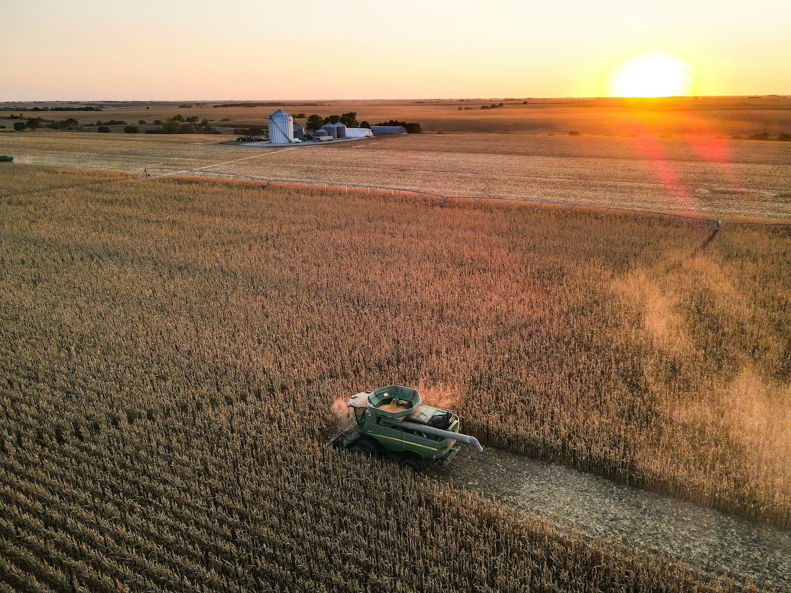

<div style="text-align: center;">

<p style="font-size: 0.8em; color: #888; margin-top: 0.4em;">Photo by <a href="https://unsplash.com/@taylorsiebert?utm_source=unsplash&utm_medium=referral&utm_content=creditCopyText">Taylor Siebert</a> on <a href="https://unsplash.com/photos/green-car-on-brown-field-during-sunset-XuGmpWwt3xc?utm_source=unsplash&utm_medium=referral&utm_content=creditCopyText">Unsplash</a>.</p>
</div>

The Farm Credit System (FCS) is a nationwide network of borrower-owned lending cooperatives created by Congress in 1916 to ensure that farmers, ranchers, and rural residents have reliable access to credit.[^1] Today the FCS operates through roughly 60 regional associations, each serving a defined geographic territory, supported by a handful of banks that fund the loans. As of 2021, the system held 45 percent of all U.S. farm sector debt, more than any other lender category in the country.[^2] The whole network is regulated and examined by the Farm Credit Administration (FCA), a federal agency established "to ensure that Farm Credit System institutions...are safe, sound, and dependable sources of credit."[^3]

Fair warning before diving in: I am a regional economist and *not* an ag finance scholar! My interest in Farm Credit grows out of some [ongoing work on "bank deserts"](https://www.sciencedirect.com/science/article/pii/S0143622824000067) and the downstream economic consequences that follow. In that research, we have tried to incorporate credit unions and Farm Credit associations alongside FDIC-regulated branches. The problem is that unlike [FDIC](https://banks.data.fdic.gov/bankfind-suite/SOD) and [NCUA](https://ncua.gov/analysis/credit-union-corporate-call-report-data) data, which are freely available and well-structured, the geographic locations of Farm Credit branches and headquarters are surprisingly difficult to pin down. 

Back in 2022, I cobbled together a time-consuming method to collect Farm Credit branch addresses, state by state. That approach worked out okay, but it isn't something I would care to repeat. As we continue building out our research on brick-and-mortar lending access,[^4] I wanted a cleaner, more reproducible pipeline. And with the assistance of Claude Code, I built one!


## Mapping the Farm Credit System

Branch office locations were scraped from the [Farm Credit "Find a Lender" tool](https://farmcredit.com/find-a-lender/), which enables a county-level lender search. To get complete national coverage, I queried every county in every state and deduplicated the results. Headquarters addresses came from a separate source: the [FCA Public Directory](https://apps.fca.gov/FCSPublicDirectory/PubViewInstitutionsBySysDist.aspx), which lists every chartered institution along with its official address. I scraped the detail page for each institution, parsed the address into its component fields, and fuzzy-joined the results to the Farm Credit organization names to produce a unified dataset of branch and headquarters locations across the country.

The map below plots every Farm Credit branch and headquarters location in the United States.[^5] Click the legend to toggle between location types (branch vs. HQ), hover over any point for name and address details, and use the buttons below to download the full dataset in CSV or GeoJSON format.

```{r}
#| echo: false
#| warning: false
#| message: false

library(tidyverse)
library(tigris)
library(sf)
library(mapgl)
library(glue)

all_locations_sf <- st_read("farmcredit_locations.geojson", quiet = TRUE)

usa <- counties(cb = TRUE, resolution = '20m', progress_bar = FALSE) |>
  filter(STATEFP < 60) |>
  select(st = STUSPS)

us  <- summarise(group_by(usa, st))
us48 <- filter(us, !st %in% c('AK', 'HI'))

all_locations_sft <- all_locations_sf |>
  mutate(
    type_color = case_when(
      office_type == "Headquarters" ~ "#e34a33",
      .default = "#5b8dd9"
    ),
    tooltip = glue::glue(
      "<b>{organization}</b>",
      "<hr style='margin:1px 0'>",
      "{address}<br>",
      "{city}, {st} {zip}<br>",
      "<i style='color:{type_color}'>{office_type}</i>"
    )
  )

maplibre(bounds = us48, style = carto_style('voyager')) |>
  add_line_layer(
    id     = 'st_outlines',
    source = us,
    line_color = 'black',
    line_width = 0.4
  ) |>
  add_circle_layer(
    id     = 'fca_locations',
    source = all_locations_sft |> 
      mutate(office_type = ifelse(
        office_type == 'Headquarters', 'HQ', office_type)
      ),
    circle_color = match_expr(
      column = "office_type",
      values = c("Branch", "HQ"),
      stops  = c("#5b8dd9", "#e34a33")
    ),
    circle_radius       = 5,
    circle_stroke_color = 'white',
    circle_stroke_width = 0.5,
    circle_opacity      = 0.85,
    tooltip = "tooltip",
    popup   = "tooltip"
  ) |>
  add_categorical_legend(
    legend_title = "Location Type",
    values   = c("Branch", "HQ"),
    colors   = c("#5b8dd9", "#e34a33"),
    layer_id = "fca_locations",
    position = "bottom-left",
    interactive = TRUE
  )
```

<div style="margin-top: 1.2em;">
<a href="farmcredit_locations.csv" download class="btn btn-primary">Download CSV</a>
<a href="farmcredit_locations.geojson" download class="btn btn-primary" style="margin-left: 4px;">Download GeoJSON</a>
</div>


### Maps & Data by State

Use the dropdown to filter by one or more states. The map, markers, and table below are all linked, so selecting a state updates everything at once. You can also draw a bounding box directly on the map using the rectangular selection tool in the upper-left corner. The sortable table lists every branch and headquarters location for the selected states, and you can download the filtered results as a CSV using the button below the table.

```{r}
#| echo: false
#| warning: false
#| message: false

library(crosstalk)
library(leaflet)
library(reactable)
library(htmltools)
library(fontawesome)

stxw <- read_csv('https://raw.githubusercontent.com/kjhealy/fips-codes/refs/heads/master/state_fips_master.csv') |> 
    select(st = 2, state = 1)

locs_df <- all_locations_sft |>
  mutate(
    lng = st_coordinates(geometry)[, 1],
    lat = st_coordinates(geometry)[, 2]
  ) |>
  st_drop_geometry() |>
  arrange(st, city) |> 
  left_join(stxw) |> 
  mutate(st = state,
  state = NULL) |> 
    filter(st != 'Hawaii')

shared <- SharedData$new(locs_df)

pal <- colorFactor(c("#5b8dd9", "#e34a33"), levels = c("Branch", "Headquarters"))

div(
  style = "width:50%; margin-left:auto;",
  filter_select("state_filter", "Select state(s):", shared, ~st, multiple = TRUE)
)

leaflet(shared, height = 450) |>
  addProviderTiles(providers$CartoDB.Positron) |>
  addCircleMarkers(
    lng         = ~lng,
    lat         = ~lat,
    fillColor   = ~pal(office_type),
    fillOpacity = 0.85,
    color       = "white",
    weight      = 1,
    radius      = 6,
    popup       = ~tooltip
  ) |>
  addLegend(
    position = "bottomleft",
    colors   = c("#5b8dd9", "#e34a33"),
    labels   = c("Branch", "Headquarters"),
    opacity  = 0.85
  )

tagList(
  reactable(
    shared,
    elementId       = "state-table",
    searchable      = TRUE,
    highlight       = TRUE,
    striped         = TRUE,
    bordered        = TRUE,
    defaultPageSize = 5,
    showPageInfo    = FALSE,
    showPageSizeOptions = TRUE,
    columns = list(
      organization = colDef(name = "Organization", minWidth = 180, sticky = "left"),
      address      = colDef(name = "Address",      minWidth = 160),
      city         = colDef(name = "City",         minWidth = 110),
      st           = colDef(name = "State",        maxWidth =  120),
      zip          = colDef(name = "ZIP",          maxWidth =  70),
      office_type  = colDef(name = "Office Type",  maxWidth = 110),
      tooltip      = colDef(show = FALSE),
      type_color   = colDef(show = FALSE),
      lng          = colDef(show = FALSE),
      lat          = colDef(show = FALSE)
    ),
    theme = reactableTheme(
      borderColor      = "#dfe2e5",
      stripedColor     = "#f6f8fa",
      highlightColor   = "#f0f5f9",
      cellPadding      = "6px 8px",
      style            = list(fontFamily = "-apple-system, BlinkMacSystemFont, Segoe UI, Helvetica, Arial, sans-serif", fontSize = "13px"),
      searchInputStyle = list(width = "100%")
    )
  ),
  tags$button(
    tagList(fa("download"), " Download CSV"),
    onclick = "Reactable.downloadDataCSV('state-table', 'farmcredit_locations.csv')",
    class   = "btn btn-sm btn-outline-secondary mb-2 mt-3"
  )
)
```


### Maps & Data by Institution Name

Use the dropdown below to filter by institution name, letting you see the full footprint of a specific lender, compare two associations side by side, or just figure out which organization serves a county you care about. Like the state view above, the map and table stay in sync as you make selections.

```{r}
#| echo: false
#| warning: false
#| message: false

shared_org <- SharedData$new(locs_df)

div(
  style = "width:50%; margin-left:auto;",
  filter_select("org_filter", "Select organization(s):", shared_org, ~organization, multiple = TRUE)
)

leaflet(shared_org, height = 450) |>
  addProviderTiles(providers$CartoDB.Positron) |>
  addCircleMarkers(
    lng         = ~lng,
    lat         = ~lat,
    fillColor   = ~pal(office_type),
    fillOpacity = 0.85,
    color       = "white",
    weight      = 1,
    radius      = 6,
    popup       = ~tooltip
  ) |>
  addLegend(
    position = "bottomleft",
    colors   = c("#5b8dd9", "#e34a33"),
    labels   = c("Branch", "Headquarters"),
    opacity  = 0.85
  )

tagList(
  reactable(
    shared_org,
    elementId       = "org-table",
    searchable      = TRUE,
    highlight       = TRUE,
    striped         = TRUE,
    bordered        = TRUE,
    defaultPageSize = 5,
    showPageInfo    = FALSE,
    showPageSizeOptions = TRUE,
    columns = list(
      organization = colDef(name = "Organization", minWidth = 180, sticky = "left"),
      address      = colDef(name = "Address",      minWidth = 160),
      city         = colDef(name = "City",         minWidth = 110),
      st           = colDef(name = "State",        maxWidth =  120),
      zip          = colDef(name = "ZIP",          maxWidth =  70),
      office_type  = colDef(name = "Office Type",  maxWidth = 110),
      tooltip      = colDef(show = FALSE),
      type_color   = colDef(show = FALSE),
      lng          = colDef(show = FALSE),
      lat          = colDef(show = FALSE)
    ),
    theme = reactableTheme(
      borderColor      = "#dfe2e5",
      stripedColor     = "#f6f8fa",
      highlightColor   = "#f0f5f9",
      cellPadding      = "6px 8px",
      style            = list(fontFamily = "-apple-system, BlinkMacSystemFont, Segoe UI, Helvetica, Arial, sans-serif", fontSize = "13px"),
      searchInputStyle = list(width = "100%")
    )
  ),
  tags$button(
    tagList(fa("download"), " Download CSV"),
    onclick = "Reactable.downloadDataCSV('org-table', 'farmcredit_locations.csv')",
    class   = "btn btn-sm btn-outline-secondary mb-2 mt-3"
  )
)
```


## Under the Hood

The R script below handles everything: scraping the Farm Credit lender directory county by county, supplementing with FCA-sourced headquarters addresses, geocoding all locations via the Mapbox API, and producing the GeoJSON and CSV files used in the maps above. If you run it yourself, please leave the built-in request throttle in place; it pauses between batches to avoid overloading the servers.

<div style="margin-top: 1.2em;">
<a href="scrape_farmcredit.R" download class="btn btn-primary" style="margin-left: 4px;">R Script</a>
</div>


[^1]: 
Hutchins, J. (2023). The US farm credit system and agricultural development: Evidence from an early expansion, 1920–1940. *American Journal of Agricultural Economics*, 105(1), 3-26. <br> Turvey, C. G., Carduner, A., & Ifft, J. (2021). Market microstructure and the historical relationship between the US farm credit system, farm service agency and commercial bank lending. *Agricultural Finance Review*, 81(3), 360-385.

[^2]:
Subedi, D., & Giri, A. K. (2024). [*Debt Use by U.S. Farm Businesses, 2012–2021*](https://www.ers.usda.gov/publications/pub-details?pubid=109411). Economic Information Bulletin No. EIB-273. U.S. Department of Agriculture, Economic Research Service. 

[^3]:
Farm Credit Administration. [*About FCA*](https://www.fca.gov/about/about-fca). U.S. Government Agency. 

[^4]:
By "we" I am referring to myself, [Tessa Conroy](https://aae.wisc.edu/faculty/tconroy2/), [Dayton Lambert](https://experts.okstate.edu/dayton.lambert), and [Kelsey Thomas](https://www.ers.usda.gov/authors/ers-staff-directory/kelsey-l-thomas-conley). The follow-up to our paper on bank deserts is called *Bank Branch Concentration and Regional Small Business Lending* and will be ready to share soon. Rounding out the trio, our final paper will take aim at causality, estimating how bank branch closures affect new business formation (or the lack thereof) in affected communities.

[^5]:
Hawaii's two Farm Credit branches are included...you just have to zoom out to find them. I did not find any Alaskan branches in the Farm Credit lender directory.